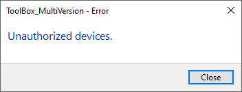

# Revit-Toolbox-MultiVersion

A single application bundle that includes several plugins to boost your productivity.

Compatible with Autodesk Revit versions 2019, 2020, 2021, 2022, 2023, and 2024.

## Table of Contents
- [Revit-Toolbox-MultiVersion](#revit-toolbox-multiversion)
	 - [Download](#download)	 
	 - [How To Install](#how-to-install)	 
	 - [How To Uninstall](#how-to-uninstall)
	 - [Read here if you installed ToolBox before](#read-here-if-you-installed-toolbox-before)

## Download

Visit [Release Pages](https://github.com/Shirocode1346/Revit-Toolbox/releases) to download.

## How To Install
#### Before Install
- Download and Extract the latest release ToolBox.rar.
- Close Revit.

#### Install via Installer
1. Open `Installer.exe` in the extracted folder.\
	
2. Input Version want to install `(20xx)` and Press `Enter`.
3. Done. 
	 - Success.\
		
	 - Fail - Revit is Running.\
		
	- Fail - Target Revit Version does not installed on computer.\
		
	- Fail - Target ToolBox Version does not exist in the same folder as the installer.\
		

#### Install manually
1. Open Revit Addin Folder  - `%Appdata%\Autodesk\Revit\Addins`.
2. Copy folder `(20xx)` from extracted folder to Revit Addin Folder.
3. Done.\
	

#### Running Revit after install ToolBox for first time
1. Select `Always Load` button in the `Add-in Loading Dialog` .\
		
2. Open any revit file, a new `ToolBox` ribbontab will created.
3. Click `Activation` to active the add-in.\
		
	
#### Unauthorized devices
If you encountered this situation, please contact me via whatsapp.\
		
	
## How To Uninstall
#### Before Uninstall
- Close Revit.

#### Uninstall manually
1. Open Revit Addin Folder - `%Appdata%\Autodesk\Revit\Addins`.
2. Delete all files/folders start with `ToolBox` inside `{Revit Version folder}`.
3. Done.\
		
	
## Read here if you installed ToolBox before
If you installed `ToolBox_T2E`, `ToolBox_2021`, `ToolBox_2022`, `ToolBox_2023`before, you should follow the steps below to delete the old version of `ToolBox` before installing `Toolbox-MultiVersion`.

1. Open Revit Addin Folder (ProgramData)  - `%ProgramData%\Autodesk\Revit\Addins`.
2. Delete all files/folders start with `ToolBox` inside `{Revit Version folder}`.
3. Done.\
		
